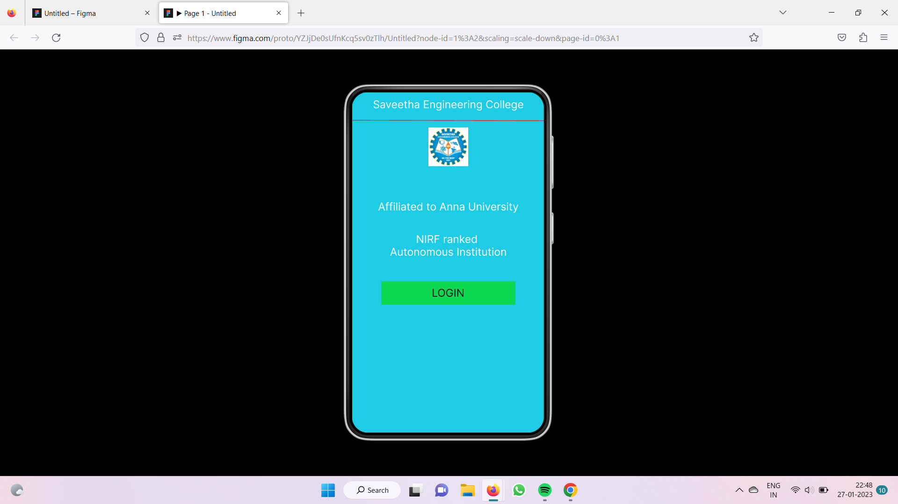
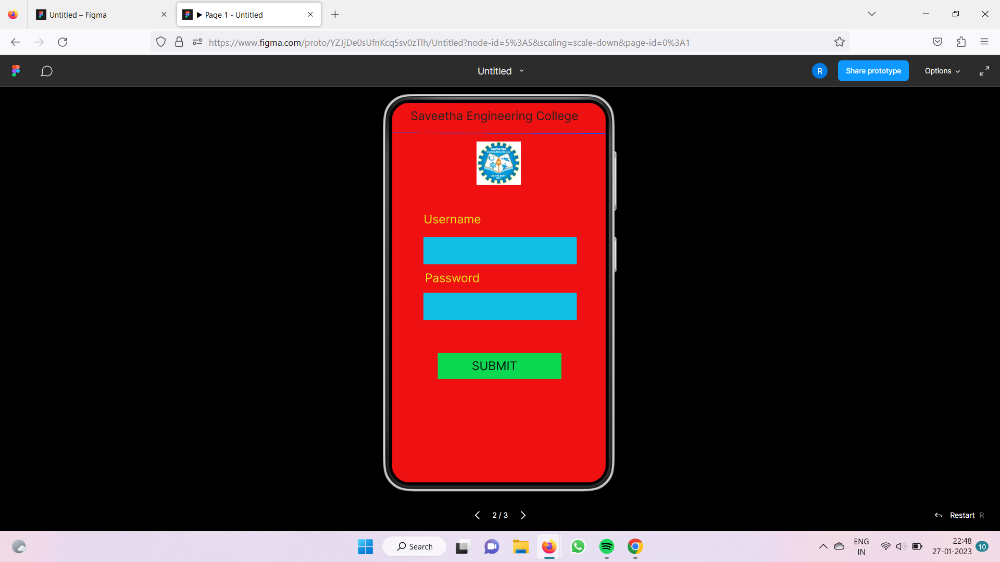
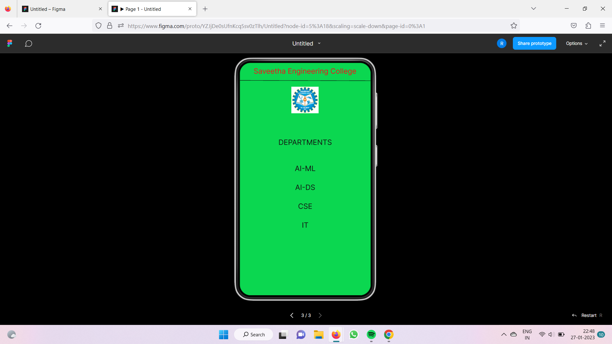

# Event Registration Web Application

## AIM:
To design, develop and deploy a web application for event registration.

## DESIGN STEPS:

### Step 1:
Create a new frame.

### Step 2:
Select any one preset size of your choice.

### Step 3:
Select the shapes you need.

### Step 4:
Import images as needed.

### Step 5:
Create pages based on your need and link them.

### Step 6:

Validate the HTML and CSS code.

### Step 6:

Publish the website in the given URL.

## DESIGN TOOL:
Figma

## code:
```
/* SEC page */
position: relative;
width: 360px;
height: 641px;
background: #0BD750;

/* Login Page */
position: relative;
width: 360px;
height: 640px;
background: #EF1111;

/* Saveetha Engineering College */
position: absolute;
width: 331px;
height: 42px;
left: 15px;
top: 11px;
font-family: 'Inter';
font-style: normal;
font-weight: 400;
font-size: 20px;
line-height: 24px;
text-align: center;
color: #FFFFFF;

/* Saveetha Engineering College */
position: absolute;
width: 331px;
height: 42px;
left: 15px;
top: 194px;
font-family: 'Inter';
font-style: normal;
font-weight: 400;
font-size: 20px;
line-height: 24px;
display: flex;
align-items: center;
text-align: center;
color: #FFFFFF;

/* Saveetha Engineering College */
position: absolute;
width: 331px;
height: 42px;
left: 15px;
top: 267px;
font-family: 'Inter';
font-style: normal;
font-weight: 400;
font-size: 20px;
line-height: 24px;
display: flex;
align-items: center;
text-align: center;
color: #FFFFFF;

/* Line 1 */
position: absolute;
width: 360px;
height: 0px;
left: 0px;
top: 53px;
border: 1px solid #FD0B19;
transform: rotate(0.16deg);

/* logo 1 */
position: absolute;
width: 75px;
height: 73px;
left: 143px;
top: 66px;
background: url(logo.png);

/* Rectangle 1 */
position: absolute;
width: 251px;
height: 44px;
left: 55px;
top: 355px;
background: #0BD750;

/* LOGIN */
position: absolute;
width: 62px;
height: 24px;
left: 149px;
top: 365px;
font-family: 'Inter';
font-style: normal;
font-weight: 400;
font-size: 20px;
line-height: 24px;
display: flex;
align-items: center;
text-align: center;
color: #100F0F;
```

## OUTPUT:




## RESULT:
The program to design, develop and deploy a web application for event registration is completed successfully.

